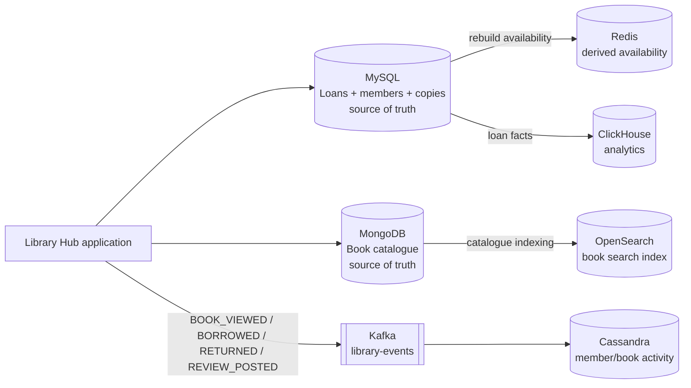

# Library Hub — Multi-Database Final Project

A Docker Compose starter implementation for the Library Hub track of the Databases Technologies and Infrastructure final project.

## Architecture



## Services

| Service | Purpose | Port |
|---|---|---:|
| MySQL | transactional loans, members, copies | 3306 |
| Cassandra | query-driven activity history | 9042 |
| MongoDB | flexible book catalogue | 27017 |
| Redis | derived availability cache | 6379 |
| OpenSearch | text and structured search | 9200 |
| ClickHouse | analytical queries | 8123 / 19000 |
| Kafka | event transport | 9092 |

## Start

```bash
docker compose up -d
# Check service state
docker compose ps
```

MySQL, MongoDB and ClickHouse run their init scripts on first start. Cassandra and OpenSearch are initialised by the one-shot `cassandra-init` and `opensearch-init` containers, which show as `Exited (0)` when they finish successfully. Init scripts only run against empty volumes, so to reset everything and re-run initialisation use `docker compose down -v && docker compose up -d`.

The database init scripts are mounted into the relevant containers. Some services need a few seconds to become ready after startup. Run the commands below after `docker compose ps` shows the containers running.

## Execute the evidence queries

```bash
# MySQL
cat mysql/queries.sql | docker compose exec -T mysql mysql -u library -plibrary libraryhub

# Cassandra
cat cassandra/queries.cql | docker compose exec -T cassandra cqlsh

# MongoDB
mongosh --host localhost:27017/libraryhub mongodb/queries.js

# Redis
redis-cli -h localhost < redis/queries.redis

# OpenSearch
curl -s -H 'Content-Type: application/json' -X GET localhost:9200/books/_search --data-binary @opensearch/queries/text-search.json
curl -s -H 'Content-Type: application/json' -X GET localhost:9200/books/_search --data-binary @opensearch/queries/text-filter.json

# ClickHouse
cat clickhouse/queries.sql | docker compose exec -T clickhouse clickhouse-client --multiquery
```

## Kafka flow

Start the consumer and producer from the application directory:

```bash
python -m venv .venv && . .venv/bin/activate
pip install -r app/requirements.txt
python app/consumer.py
python app/producer.py
```

The producer sends sample library events to `library-events`; the consumer reads them and writes denormalised rows to Cassandra. The application code is intentionally small so the database design and evidence remain easy to inspect.

## Source of truth and recovery

- MongoDB is authoritative for catalogue fields. OpenSearch can be rebuilt by reading `mongodb/init.js` data and indexing it again.
- MySQL is authoritative for members, physical copies, and loans. Redis availability values can be rebuilt with the aggregation in `redis/rebuild.sql`.
- Kafka transports events; Cassandra is an activity read model. Cassandra activity can be replayed from retained Kafka events or rebuilt from an event export.
- ClickHouse is analytical/derived and can be reloaded from MySQL loan facts.

## Required evidence checklist

- MySQL: individual lookup, member loan history, join, transaction before/after, failed double-loan consistency test, stored procedure.
- Cassandra: recent member activity and recent book history without `ALLOW FILTERING`.
- MongoDB: one document, flexible technical attribute, indexed field query.
- Redis: create/update, retrieve, modify, and rebuild explanation.
- OpenSearch: text search and text plus category filter.
- ClickHouse: loans by day, top books, and loans by category.

See `report/technical-report-outline.md` for the report structure and the database-by-database explanation.
